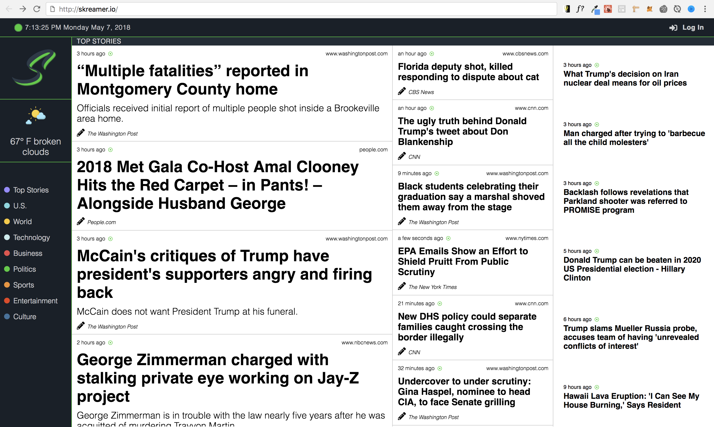

## Skreamer - Headline News App

[LIVE DEMO](http://5af37120b31274206a0c5778.reverent-galileo-eff65a.netlify.com/)

#### Concept

With a dizzying amount of different media sources for all categories of news, I wanted to make a simple app that would allow me to see all the main headlines from a whole variety of sources without having to visit each individual website separately. 

#### Tools
1. ReactJS - Create-React-App
2. NewsAPI
3. SCSS
4. Moment.js
5. React-Router
6. Axios
7. Responsive Design

#### Issues
None currently.